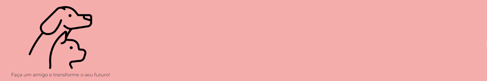
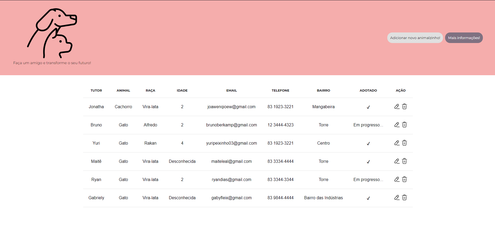
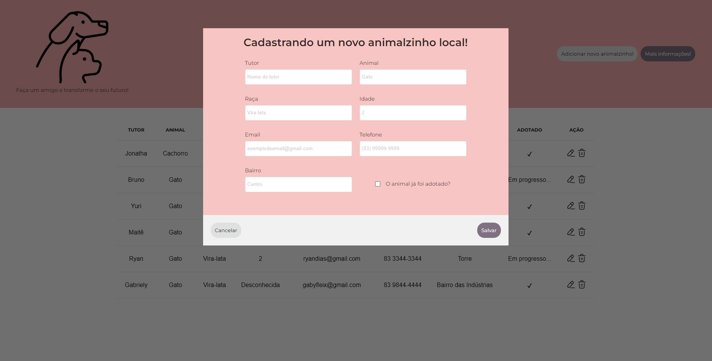

<div class="header">
     
</div>

---

<br>
<br>

<div align="center">

# AdoteUmBichinho! 🐶

**AdoteUmBichinho!** é um CRUD de gerenciamento de informação com armazenamento em LocalStorage de nível iniciante feito somente com HTML, CSS e JavaScript

<br>
</div>

<div align="center">

# POR QUE ESSE PROJETO EXISTE?

Esse repositório tem como objetivo a prática do desenvolvimento em JavaScript, e por ser algo consideravelmente simples, é possível que outros estudantes iniciantes na área de desenvolvimento front-end consigam utilizar esse projeto para praticar.

</div>

<br>

<div align="center">

# GALERIA 🐱🐰🐹





</div>

<br>

<div align="center">

# NOTAS DO PROJETO

</div>

- Esse projeto não possui responsividade e foi desenvolvido exclusivamente para dispositivos desktop. É fortemente recomendado uma tela superior a 800px de largura.    

<br>

<div align="center">

# COMO RODAR O PROJETO?

</div>

```bash
# Clone o repositório
git clone https://github.com/yagopeixinho/AdoteUmBichinho.git

# Entre em uma IDE de sua preferência

# Executar o servidor ou usar um plugin que criar um servidor
```

Feito isso, abra o seu navegador e acesse `http://localhost:5500/`
ou em uma porta de sua preferência.

<br>

<div align="center">

# CONTATO

</div>

Se você gostou do projeto, tem alguma crítica construtiva ou quer entrar em contato por qualquer outro motivo. Abaixo tem algumas opções:

- 🌎 Compartilhe esse repositório com seus amigos :D
- ⭐ Se gostou da ideia você pode fazer um fork ou favoritar o projeto
- 📬 Me envie um e-mail caso você precise de algo: peixinhoyago@gmail.com

<br>

<div align="center">

# COLABORADORES

</div>

<table align="center">
    <tr>
        <td align="center"> 
		    <a href="https://github.com/yagopeixinho">
			        
<br/>  
		        <sub>
				    <b>Yago Peixinho</b>
		        </sub>
		    </a> 
	    </td> 
    </tr>
</table>
